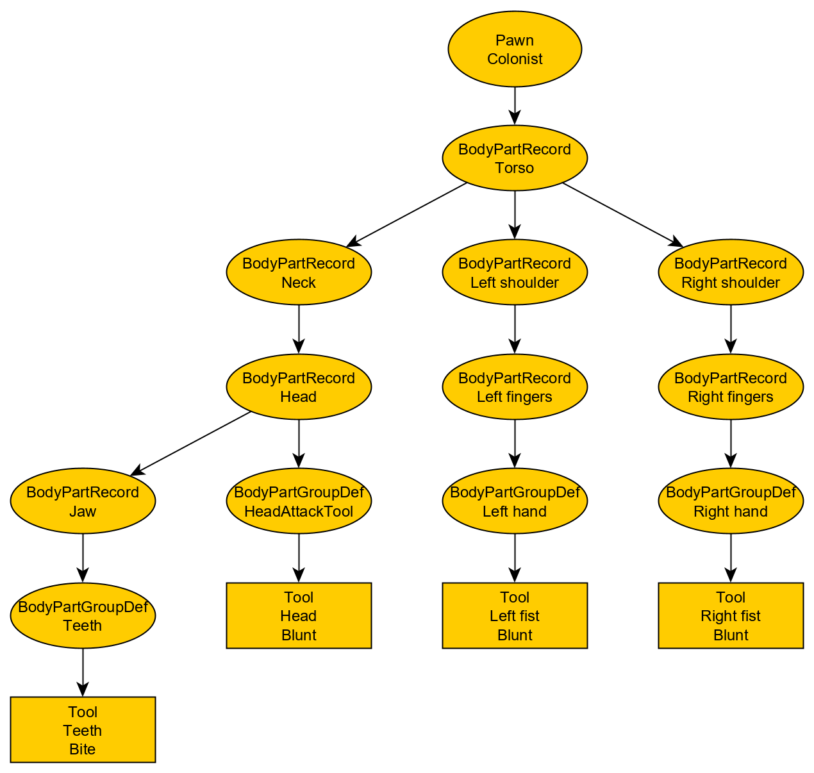

# HediffCompProperties_ToolPowerAdjust

The EBF introduces `HediffCompProperties_ToolPowerAdjust` as a common `HediffCompProperties` for other modders to designate tool power adjustments for their `Hediff`s. In other words, melee combat DPS of pawns may be increased through the use of `Hediffs` with `HediffCompProperties_ToolPowerAdjust`.

Please refer to the appendix in the `README.md` file for learning how to add `HediffCompProperties` to your `Hediff` in general.

Please note that the full designation of the Hediff is `EBF.Hediffs.HediffCompProperties_ToolPowerAdjust`. Make sure you get this correct.

Note: some conditions ("Conditions") have to be met in order to make use of an effective `HediffCompProperties_ToolPowerAdjust`. These conditions will be elaborated in a later section.

Under EBF, if the Conditions are met, the melee damage of a hediff with `HediffCompProperties_ToolPowerAdjust` is modified by the following formula:

```New melee damage = game-calculated melee damage * product(all factors generated by scaleAdjustment) + sum(all values from linearAdjustment)```.

If you have worked with `HediffCompProperties_MaxHPAdjust` before, the above formula should look familiar, with only a few term changes to fit the tool power adjustment.

Note that the term `game-calculated melee damage` already includes various factors, such as pawn health, original tool power, and other factors that the game may have used.

There are currently 2 properties under `HediffCompProperties_ToolPowerAdjust`.

## `linearAdjustment`
Takes an integer: if the Conditions are met, the `Hediff` will offset the tool power (and in turn, the melee damage) by this value; defaults to 0 if not set.

## `scaleAdjustment`
Takes a float: if the Conditions are met, the `Hediff` will scale the tool power (and in turn, the melee damage) by this value; defaults to 0 if not set.

The factor to be used in multiplication is obtained according to these rules:
- If the value is 0, then the factor is 1 (i.e. no change).
- If the value is not larger than -1, then the factor is 1 (value rejected, and no change)
- All other values will scale the tool power (and in turn, the melee damage) by a factor of (`scaleAdjustment` + 1)
  - Example: a value of `0.1` will give a factor of `1.1`; new damage is 1.1 times of original
  - Example: a value of `-0.6` will give a factor of `0.4`; new damage is 0.4 times of original
  - Example: a value of `2` will give a factor of `3` (but please don't do that, it will be OP)

The scaling will be applied just like other scaling factors available in vanilla game, such as pawn manipulation multiplier, and pawn consciousness multiplier, and as such, I believe it will also affect values such as armor penertration.

# The Conditions
As stated above, some conditions are required to make use of an effective `HediffCompProperties_ToolPowerAdjust`. Here, the conditions are described.

## Case 1: HediffCompProperties_ToolPowerAdjust applied to Hediff_Implant
The `Hediff_Implant` with `HediffCompProperties_ToolPowerAdjust` (the Comp) must be directly installed onto:

- A `HediffWithComps` with a `HediffCompProperties_VerbGiver` comp: the Comp will adjust the melee damage of the tools that are present on the `HediffWithComps`
- A body part which has the same `BodyPartGroupDef` as the tool: see example below

Melee damage adjustment from `HediffCompProperties_ToolPowerAdjust` on the same `BodyPartGroupDef` is stackable

See the following example of installing a hypothetical "non-invasive integrated combat knuckles" that increases the user's melee damage on a Colonist's left fist
- For an unmodded Colonist, they have a tool "left fist" located at `BodyPartGroupDef = LeftHand`
- The knuckles implant shall be installed on a body part which also is at `BodyPartGroupDef = LeftHand`, such as:
  - Left hand
  - Middle finger

Otherwise, the Comp will have no effect.

## Case 2: HediffCompProperties_ToolPowerAdjust applied to HediffWithComps which is not Hediff_Implant
This is a bit complicated, but in short:

- The `HediffWithComps` must provide `Tool`s that replace some of the original body's tool
  - Replacement can happen "at" or "above" the supposed position of the original tool
- `Tool`s with equal `ToolCapacityDef`s can replace each other
  - Note that a tool can have multiple `ToolCapacityDef`s (see Muffalo left/right hoof having `Blunt` and `Poke`); in such cases, all `ToolCapacityDef`s of one tool must be present on the other tool to make them replaceable to each other

If the Framework can determine that the hediff did replace some tools, it will use the original tool's power as the base value to adjust melee damage; the tool power of the replacing tool will become a dummy value and have no effect on melee damage calculation.

For example, the vanilla Bionic Arm provides a fist `Tool (Blunt only) (power 12)` to the Colonist, replacing their (depending on installed shoulder) original left/right fist `Tool (Blunt only) (power 8.2)`. Adding `HediffCompProperties_ToolPowerAdjust` to the Bionic Arm will prompt the Framework to use the original left/right fist power (8.2) to base the melee damage adjustment.

## Graphically explaining Case 2
So, for an unmodded Colonist, its tools and body parts should resemble a tree like this:



Suppose we install a BIonic Arm at Left shoulder. AFter installation, the resembled tree should look like this:


Both the original tool and the replacing tool has `Blunt` as their only capacity. This means the tool from the Bionic Arm can replace the original tool at the fist.

If I were to add `HediffCompProperties_ToolPowerAdjust` onto the Bionic Arm, the Framework will scale melee damage using the value of the original fists as the base value.